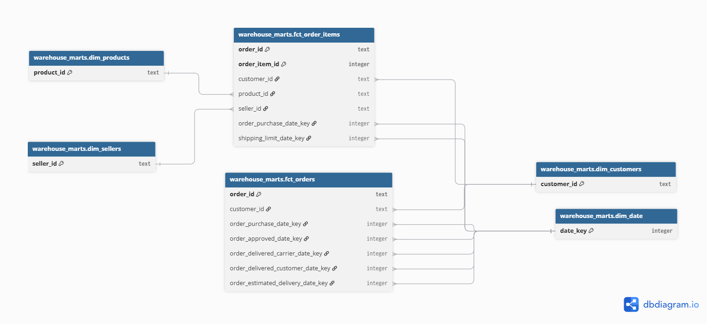
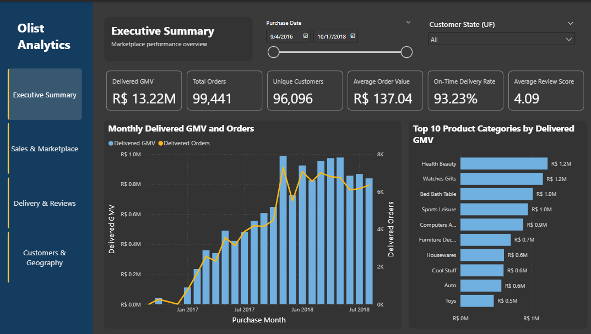

# Olist Marketplace Analytics

[](https://github.com/CollinSmiled/olist_marketplace_analytics/actions/workflows/ci.yml)

## Project Overview

An end-to-end analytics engineering project using the Brazilian E-Commerce Public Dataset by Olist. The project transforms raw marketplace data into a tested dimensional warehouse and interactive Power BI dashboard.

## Business Problem

The project investigates why orders are delayed, which sellers are underperforming, and how delivery performance is associated with customer satisfaction.

## Current Status

- Milestone 1: dataset understanding and source profiling
- Milestone 2: PostgreSQL raw ingestion
- Milestone 3: Dockerized PostgreSQL and ingestion
- Milestone 4: dbt source definitions, staging models, and data quality tests
- Milestone 5: reusable intermediate models and order-level processing
- Milestone 6: dimensional warehouse with four dimensions and two fact tables
- Milestone 7: Power BI model and four-page analytics dashboard
- Milestone 8: one-command local pipeline automation
- Milestone 9: automated project validation with GitHub Actions

## Technology Stack

- Python for ingestion and data profiling
- PostgreSQL for data storage
- SQL and dbt for transformations and testing
- Power BI for dashboards
- Docker for a reproducible local environment
- GitHub Actions for continuous integration

## Running the Project

### Prerequisites

- Docker Desktop
- The nine Olist CSV files placed in `data/raw/`

### Setup

Copy the environment template and add your PostgreSQL password:

```powershell
Copy-Item .env.example .env
```

### Complete Pipeline

Run the complete local pipeline:

```powershell
.\scripts\run_pipeline.ps1
```

The runner validates the local setup, builds the Docker images, starts PostgreSQL, reloads the raw CSV files, builds the dbt warehouse, and runs all data quality tests. PostgreSQL remains running afterward so Power BI can connect to it.

Stop the project when it is no longer needed:

```powershell
docker compose down
```

### Manual Raw Ingestion

Build the ingestion image:

```powershell
docker compose build ingestion
```

Start PostgreSQL:

```powershell
docker compose up -d postgres
```

Load the raw CSV files:

```powershell
docker compose --profile tools run --rm ingestion
```

The ingestion pipeline validates the source files, performs a transactional full refresh, and verifies the loaded row counts.

## Running dbt Manually

Build the dbt image:

```powershell
docker compose build dbt
```

Verify the dbt configuration and database connection:

```powershell
docker compose --profile tools run --rm dbt debug
```

Build and test the transformation project:

```powershell
docker compose --profile tools run --rm dbt build
```

The dbt project builds nine cleaned and typed staging views in `warehouse_staging`, five intermediate views in `warehouse_intermediate`, and six dimensional tables in `warehouse_marts`. The complete build contains 20 models and 209 data quality tests.

A warning is logged for 13 products whose original Portuguese category names are missing from the translation table.

## Continuous Integration

GitHub Actions runs when a pull request targets `main` and after changes are pushed to `main`. It validates Python and PowerShell syntax, the Docker Compose configuration, Docker image builds, and dbt project parsing.

The raw Olist files are not stored in GitHub, so complete ingestion and all 209 data tests are validated locally with:

```powershell
.\scripts\run_pipeline.ps1
```

## Warehouse Design

The reporting layer uses a fact constellation with two grains:

- `fct_orders`: one row per order
- `fct_order_items`: one row per order item



See [Warehouse Design](docs/warehouse_design.md) for the detailed schema.

## Power BI Dashboard

The Power BI report uses the dimensional warehouse to analyse marketplace performance across four pages:

- Executive Summary
- Sales & Marketplace
- Delivery & Reviews
- Customers & Geography



Open `powerbi/olist_marketplace_analytics.pbip` in Power BI Desktop after building the warehouse.

See [Power BI Dashboard](docs/power_bi_dashboard.md) for the report structure, metric definitions, and limitations.
