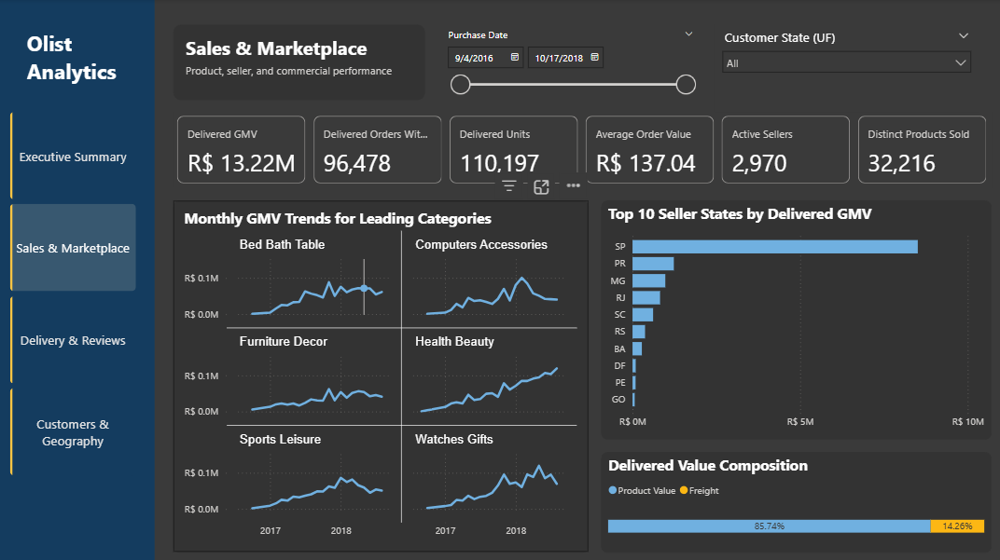
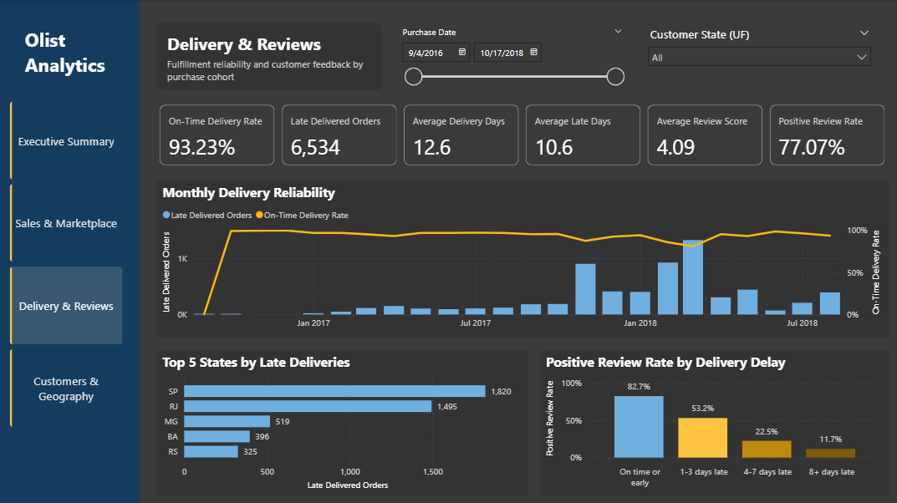
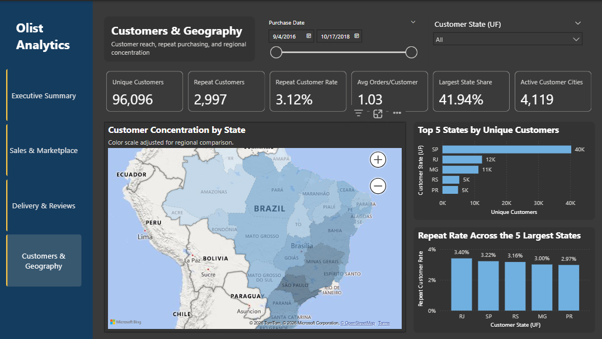

# Power BI Dashboard

The Power BI report presents the Olist warehouse as an interactive marketplace dashboard. It focuses on sales performance, delivery reliability, customer reviews, and geographic concentration.

## Semantic Model

The report imports six tables from the `warehouse_marts` schema:

- Dimensions: `dim_customers`, `dim_sellers`, `dim_products`, and `dim_date`
- Facts: `fct_orders` and `fct_order_items`

Dimensions filter the facts through one-to-many relationships. There is no direct fact-to-fact relationship.

The active date relationships use order purchase date. Additional inactive relationships are retained for approval, delivery, estimated delivery, and shipping-limit dates.

Business calculations are kept in a dedicated `Key Measures` table.

## Report Pages

### Executive Summary

Provides a high-level overview of marketplace performance, including delivered GMV, orders, customers, average order value, delivery reliability, and review scores.

### Sales & Marketplace

Examines sales performance across time, product categories, sellers, and seller locations. It also separates item revenue from freight charges.

### Delivery & Reviews

Connects delivery performance with customer satisfaction. It compares late-order volume, on-time delivery rates, delivery delays, and positive review rates.

### Customers & Geography

Shows customer reach, repeat purchasing, and regional concentration. The map uses customer coordinates to identify Brazilian states correctly.

## Metric Notes

- **Delivered GMV** is the item price of delivered orders and excludes freight.
- **Average Order Value** is delivered GMV divided by delivered orders containing item details.
- **On-Time Delivery Rate** compares the customer-delivery date with the promised calendar date.
- **Positive Review Rate** is the share of reviewed orders receiving a score of four or five.
- **Repeat Customer Rate** is the share of customers with more than one order in the selected period. It is not a cohort-retention metric.
- The customer map uses a logarithmic color measure to make regional differences visible. Tooltips continue to show actual customer counts.

## Filters

The report pages use two common filters:

- Purchase date
- Customer state (UF)

The date filter follows order purchase date unless a measure explicitly uses another date relationship.

## Limitations

- The Olist dataset is currently still a historical snapshot, not a live marketplace feed.
- Power BI data must be refreshed after rebuilding the warehouse.
- Thirteen product rows contain Portuguese categories that are missing from the provided translation table.