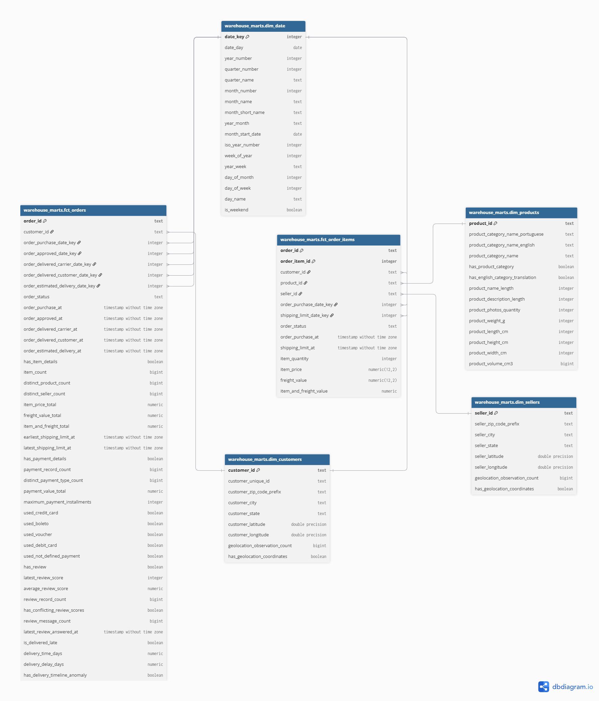

# Warehouse Design

The warehouse model design uses a fact constellation with two fact tables and four dimensions.

## Detailed Schema

## Fact Tables

- `fct_orders`: one row per order, with payment, review, and delivery measures
- `fct_order_items`: one row per `(order_id, order_item_id)`, with product, seller, price, freight, and quantity measures

## Dimensions

- `dim_customers`: one row per order-specific customer record
- `dim_products`: one row per product
- `dim_sellers`: one row per seller
- `dim_date`: one row per calendar date

`dim_date` is reused for purchase, approval, carrier handoff, delivery, estimated delivery, and shipping-limit dates.

## Design Decisions

- Source identifiers are used because the dataset is static.
- Customer and seller coordinates use representative values for each ZIP-code prefix.
- Product categories prefer English, then Portuguese, then `unknown` if not available.
- Missing order values (NULL) remain distinct from actual zero values.
- The item fact preserves the lowest reliable source grain.
- The two facts share customer and date dimensions.

## Data Quality

dbt tests validate grain, required values, accepted values, relationships, source coverage, date coverage, and reconciliation.

The complete build contains 20 models and 206 tests. One expected warning remains for 13 products whose Portuguese categories are not given from the supplied translation table.